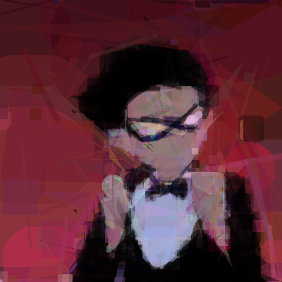

# Genetic Da Vinci

Rebuild an image out of **circles, triangles and lines** using a
genetic / hill-climbing search. Upload a picture and watch a small number of
shapes evolve into a faceted, poster-like version of it — all running locally,
no server, no account.


| Target | Reconstruction |
| --- | --- |
|  |  |

## How it works
- A **genetic algorithm** proposes batches of candidate shapes and keeps the
  ones that best match the target.
- Candidates are drawn with **Sobol quasi-random sampling** (even coverage of
  the search space instead of plain random).
- The pixel math is compiled with **Numba JIT**; each candidate is scored by
  the *change* in a running error ("partial loss"), so only the pixels a shape
  actually touches are recomputed.
- The best shape is then **adaptively mutated** (a 1/5 success rule plus a
  running average) and kept only if it improves the image.
- Everything is rendered live in a small **Gradio** web UI.

## Quick start
```bash
pip install -r requirements.txt
python app.py
```
Then open the local URL Gradio prints. Upload an image (or use the built-in
sample) and hit **Run**.

> Runs out of the box on Windows. A small font fallback means it also works on
> macOS / Linux without installing anything extra.

## Files
| File | What it is |
| --- | --- |
| `app.py` | Gradio UI (live canvas, presets, PNG/JPG download) |
| `sobol.py` | The search engine — heavily commented. Each hard Numba block has a plain-Python `*_plain` reference next to it. |
| `make_demo.py` | Headless demo generator (no server) that makes `assets/demo.gif` |
| `assets/sample_target.jpg` | Built-in sample image |

## Regenerate the demo
```bash
python make_demo.py --shapes 600
```

## Where to read
`sobol.py` is the interesting file. The top of the file has a full
explanation and a file map, and the code is split into `Section 1…9`. The
`*_plain` functions are readable, non-JIT versions of the hardest blocks
(the scanline loss and the adaptive mutation) so you can follow the compiled
code without reading Numba.
